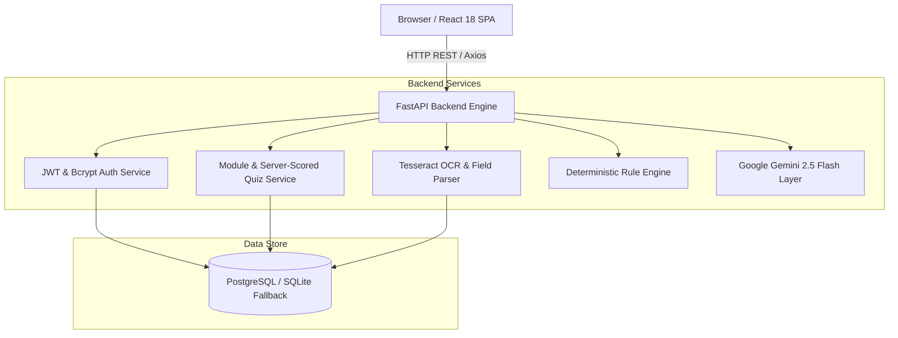

# GovSkill — Digital Skill Support for Local Government Offices

[](https://fastapi.tiangolo.com/)
[](https://reactjs.org/)
[](https://vitejs.dev/)
[](https://tailwindcss.com/)
[](https://python.org/)
[](https://www.typescriptlang.org/)
[](https://www.postgresql.org/)
[](https://ai.google.dev/)

**GovSkill** is a modern, full-stack web application built for local government offices. It features a **Core Employee Training Module** equipped with an interactive AI Tutor and a server-scored Quiz with an Admin Dashboard, plus **GovAssist** — a citizen self-service pre-submission document validator for Income Certificates.

---

## 🌟 Key Features

### 1. Core Employee Training Module
- **Structured Lesson Reader**: Interactive interface for local government staff to complete official digital workflow training ("Digital Document Handling").
- **Grounded AI Tutor**: Context-aware AI chatbot powered by Google Gemini (`gemini-2.5-flash`), strictly grounded in lesson content to assist employees when stuck.
- **Server-Scored Quiz**: 8-question MCQ quiz evaluated strictly server-side to prevent answer tampering.
- **Supervisor Admin Dashboard**: Metrics dashboard providing real-time tracking of employee quiz attempts, average scores, and pass rates (≥75%).

### 2. GovAssist (Citizen Pre-Submission Checker)
- **Public Self-Service Portal**: No citizen login required.
- **OCR Text Extraction**: Automated text extraction from uploaded Income Certificate scans (PNG, JPG, PDF, TXT) via Tesseract OCR and regex parsing.
- **Deterministic 4-Rule Validation Engine**: 100% code-driven rule engine checking:
  1. *Name Present*
  2. *Certificate Number Format* (Alphanumeric, ≥6 characters)
  3. *Certificate Validity / Expiry Date*
  4. *All Required Fields Extracted*
- **AI Explanation Layer**: Plain-language explanations generated by Gemini for any failed validation rules to guide citizens before official submission.

---

## 🏗 System Architecture



---

## 🛠 Tech Stack

| Layer | Technology | Description |
|---|---|---|
| **Backend Framework** | FastAPI (Python 3.11+) | Async REST API engine with OpenAPI interactive docs |
| **Database & ORM** | PostgreSQL 15 + SQLAlchemy 2.0 Async | Relational database with SQLite async fallback for dev/tests |
| **Database Migrations**| Alembic | Automated schema migrations |
| **Authentication** | JWT (`python-jose`) + Bcrypt (`passlib`) | Role-based Bearer token authentication (`employee` & `admin`) |
| **OCR & Processing** | Tesseract OCR (`pytesseract`) + Pillow | Local image text extraction & regex field parsing |
| **AI Integration** | Google Gemini API (`google-genai`) | Single-turn Q&A tutor and plain-language failed rule explanation |
| **Frontend Framework**| React 18 + Vite (TypeScript) | Fast client-side SPA architecture |
| **Styling & UI** | Tailwind CSS 3 + Lucide Icons | Responsive, clean public-sector aesthetic |
| **HTTP Client** | Axios | Request interceptors with auto Bearer token handling |
| **Testing** | Pytest + pytest-asyncio + httpx | Asynchronous end-to-end integration and unit testing |

---

## 📁 Project Directory Layout

```text
GovSkill/
├── AGENTS.md                   # AI agent instructions & non-negotiable rules
├── README.md                   # Main project documentation & setup guide
├── push_to_github.bat          # Automated deployment script for GitHub
│
├── docs/                       # Comprehensive Architecture & Project Docs
│   ├── PROJECT.md              # Vision, target personas, and feature breakdown
│   ├── ARCHITECTURE.md         # Detailed technical design & schema documentation
│   ├── CURRENT_STATE.md        # Live project dashboard, status, and known bugs
│   ├── DECISIONS.md            # Key architectural decision records (ADRs)
│   ├── ROADMAP.md              # Technical roadmap & future priorities
│   ├── SPECIFICATION.md        # Original product requirements document
│   └── DEBUG_LOG.md            # Master debug & stabilization history
│
├── backend/                    # FastAPI Backend Application
│   ├── alembic/                # Database migrations
│   ├── app/
│   │   ├── main.py             # FastAPI app entrypoint & middleware
│   │   ├── api/                # API routes & dependency injection
│   │   ├── core/               # Configuration & Security (JWT/Bcrypt)
│   │   ├── db/                 # Database engine & session management
│   │   ├── models/             # SQLAlchemy ORM database models
│   │   ├── schemas/            # Pydantic v2 validation schemas
│   │   ├── services/           # OCR, Rule Engine, and Gemini AI services
│   │   └── tests/              # Pytest end-to-end test suite
│   ├── uploads/                # Uploaded citizen document storage
│   ├── alembic.ini
│   ├── requirements.txt        # Python backend dependencies
│   └── .env.example
│
└── frontend/                   # React 18 + Vite Frontend Application
    ├── src/
    │   ├── App.tsx             # Main router & protected routes
    │   ├── main.tsx            # Application entry point
    │   ├── components/         # UI primitives, quiz, and document components
    │   ├── hooks/              # Global Auth context (`useAuth.tsx`)
    │   ├── layout/             # Top Navigation Header
    │   ├── lib/                # Axios API client setup
    │   ├── pages/              # App views (Login, Module, Tutor, Quiz, Admin, Citizen)
    │   └── types/              # TypeScript interfaces & type definitions
    ├── package.json
    ├── tailwind.config.js
    └── vite.config.ts
```

---

## 🚀 Quick Start & Setup Guide

### Prerequisites
- **Python 3.11+**
- **Node.js 18+** & `npm`
- **Tesseract OCR** binary installed on system PATH
  - *Windows*: Download installer from UB-Mannheim Tesseract OCR and add `C:\Program Files\Tesseract-OCR` to System PATH.

---

### 1. Backend Setup

```bash
# Navigate to backend directory
cd backend

# Create & activate Python virtual environment
python -m venv venv

# Windows PowerShell:
.\venv\Scripts\activate
# Linux/macOS:
source venv/bin/activate

# Install backend dependencies
pip install -r requirements.txt

# Copy environment variables
copy .env.example .env

# Run database migrations
alembic upgrade head

# Start FastAPI development server
uvicorn app.main:app --reload --port 8000
```

Verify backend health at: [http://localhost:8000/health](http://localhost:8000/health)

---

### 2. Frontend Setup

```bash
# Open a new terminal and navigate to frontend directory
cd frontend

# Install Node dependencies
npm install

# Start Vite development server
npm run dev
```

Open application in browser: [http://localhost:3000](http://localhost:3000)

---

## 📡 API Endpoint Reference

| Method | Path | Description | Access |
|---|---|---|---|
| `GET` | `/health` | Application health check | Public |
| `POST` | `/api/auth/register` | Register new employee or admin user | Public |
| `POST` | `/api/auth/login` | Login and receive JWT access token | Public |
| `GET` | `/api/auth/me` | Fetch authenticated user profile | Bearer Token |
| `GET` | `/api/modules/{id}` | Get lesson content for a training module | Bearer Token |
| `POST` | `/api/tutor/ask` | Submit question to Gemini AI Tutor | Bearer Token |
| `GET` | `/api/quiz/{module_id}` | Fetch quiz questions (answer key stripped) | Bearer Token |
| `POST` | `/api/quiz/{module_id}/submit` | Submit quiz answers for server-side evaluation | Bearer Token |
| `GET` | `/api/admin/attempts` | Fetch all employee quiz score history | Admin Only |
| `POST` | `/api/documents/upload` | Upload Income Certificate for OCR & Rule Engine check | Public (GovAssist) |
| `GET` | `/api/documents/{id}` | Retrieve pre-check result by document ID | Public (GovAssist) |

---

## 🧪 Testing & Verification

Run the comprehensive test suite to verify backend functionality, authentication, rule engine execution, and AI tutor fallbacks:

```bash
cd backend
pytest -v
```

---

## 📜 Documentation Sitemap

For detailed architectural and implementation information, consult the `docs/` directory:
- [AGENTS.md](AGENTS.md) — AI agent conventions and strict development rules.
- [PROJECT.md](docs/PROJECT.md) — Product requirements, user journeys, and target personas.
- [ARCHITECTURE.md](docs/ARCHITECTURE.md) — Technical specifications, database models, and design patterns.
- [CURRENT_STATE.md](docs/CURRENT_STATE.md) — Live project status dashboard and current focus.
- [DECISIONS.md](docs/DECISIONS.md) — Key architectural decision records (ADRs).
- [ROADMAP.md](docs/ROADMAP.md) — Technical roadmap and future priorities.

---

## 📄 License
This project is developed for educational and local government office support purposes.
