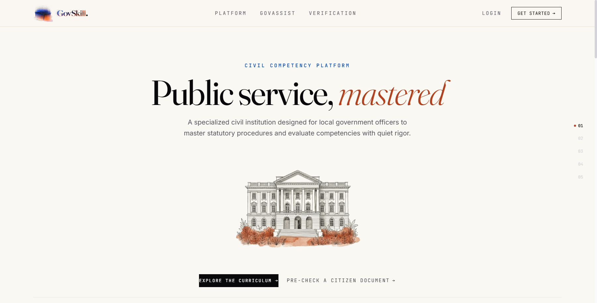
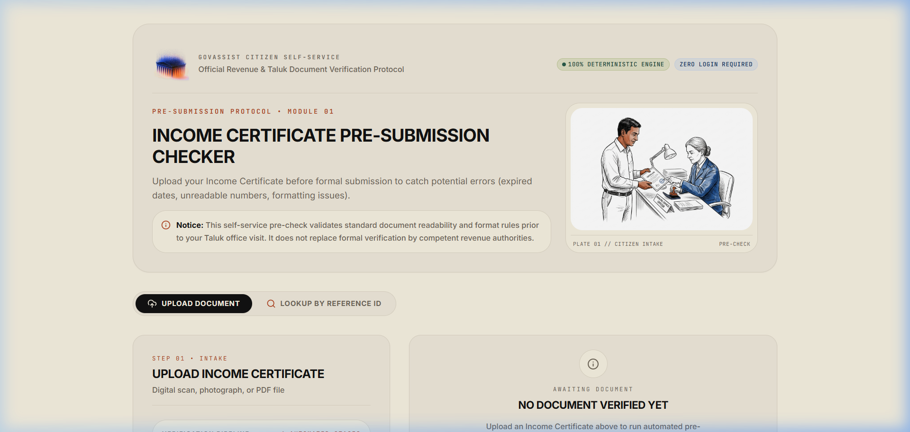
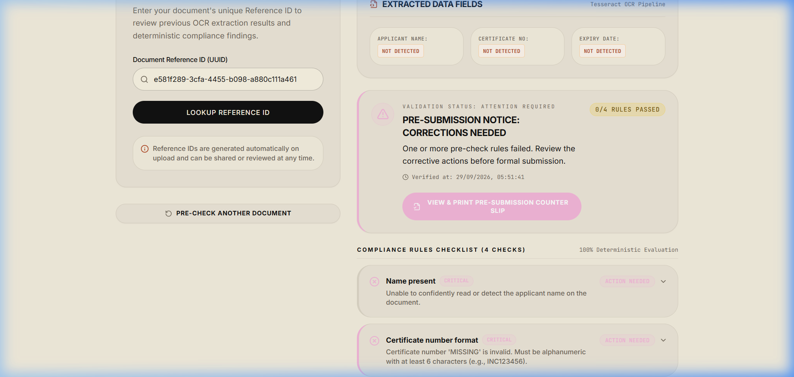
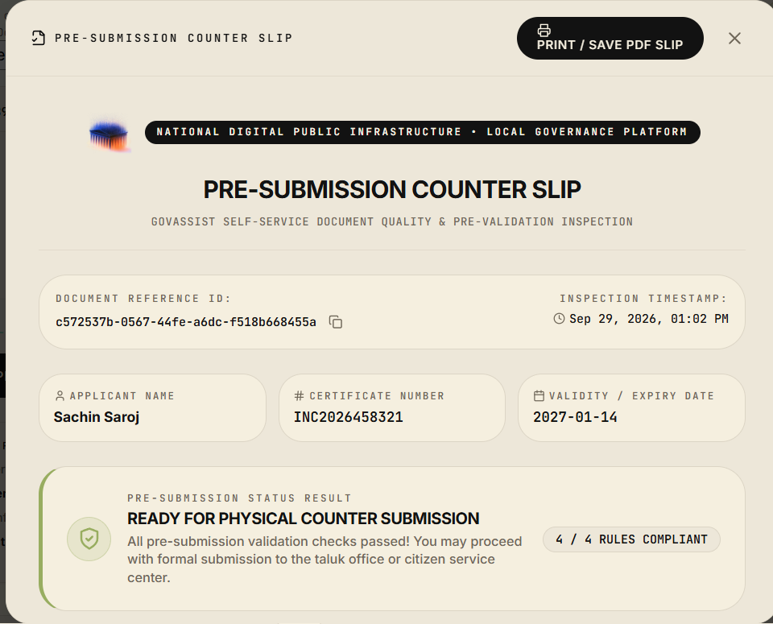
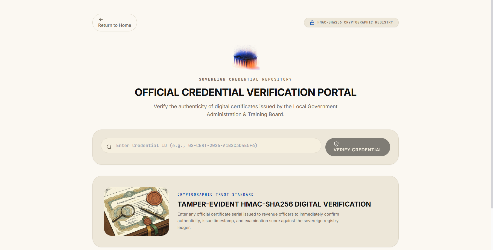
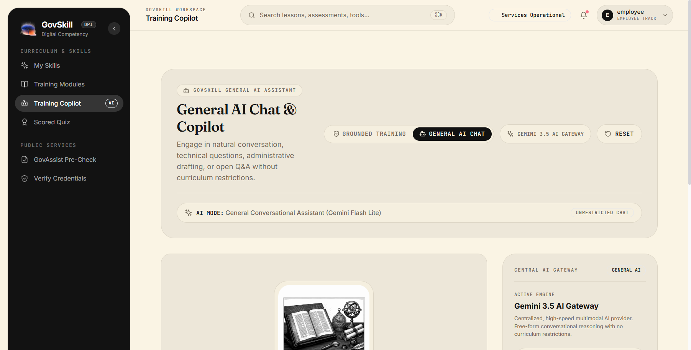
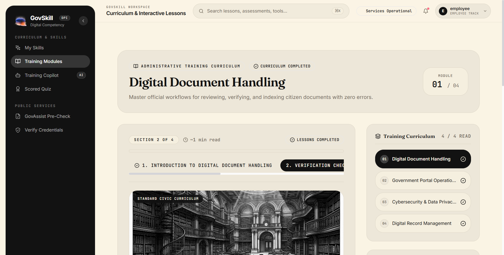
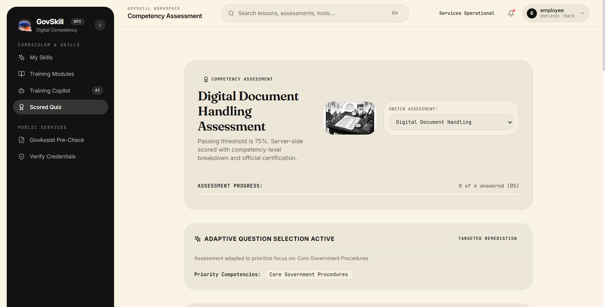
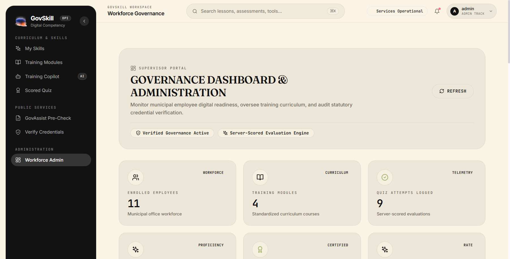
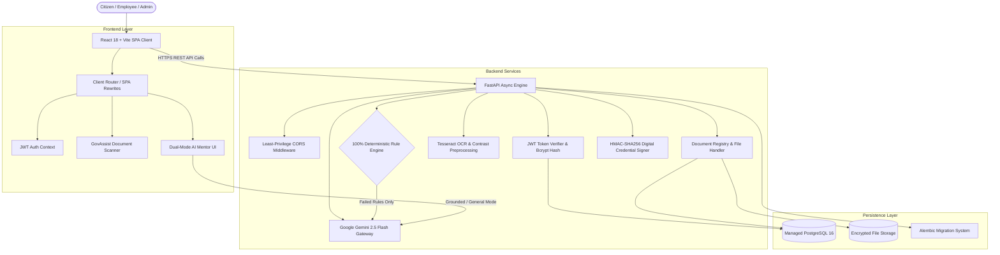

# GovSkill — Digital Skill Support & Document Intelligence Platform

[](https://govskill-frontend.onrender.com)
[](https://govskill-backend.onrender.com/health)
[](https://github.com/sachin-saroj/GovSkill)
[](https://github.com/sachin-saroj/GovSkill)

[](https://fastapi.tiangolo.com/)
[](https://reactjs.org/)
[](https://vitejs.dev/)
[](https://tailwindcss.com/)
[](https://python.org/)
[](https://www.typescriptlang.org/)
[](https://www.postgresql.org/)
[](https://ai.google.dev/)
[](https://www.docker.com/)

**GovSkill** is a production-deployed, full-stack sovereign civic platform designed for local government revenue and administrative offices. It solves two critical municipal challenges within a unified, high-integrity architecture:

1. **GovAssist (Citizen Document Pre-Submission Intelligence):** A zero-registration self-service portal where citizens pre-validate government certificates (Income, Domicile, Caste) before visiting municipal counters. Powered by an OCR text extraction pipeline, a **100% deterministic 4-rule code validation engine**, plain-language Gemini AI remediation, and printable anti-fraud counter slips with cryptographic QR verification.
2. **Civil Servant Competency & Qualification Engine:** A departmental staff training suite featuring structured legislative curriculum modules, a **Dual-Mode AI Mentor** (Grounded Curriculum Tutor vs. Multilingual General Administrative Copilot), server-evaluated anti-tamper examinations, HMAC-SHA256 digitally signed completion credentials, and supervisor administrative analytics.

---

## 🌐 Live Production Deployment

GovSkill is deployed in production on Render with a containerized Docker backend, a managed PostgreSQL 16 cluster, and a global CDN static frontend.

| Resource | Production URL | Status | Health Probe |
|---|---|---|---|
| **Frontend Web Application** | **[https://govskill-frontend.onrender.com](https://govskill-frontend.onrender.com)** | 🟢 `Active` | HTTP 200 (Render Global CDN) |
| **Backend REST API Engine** | **[https://govskill-backend.onrender.com](https://govskill-backend.onrender.com)** | 🟢 `Active` | [Probe `/health`](https://govskill-backend.onrender.com/health) |
| **Interactive API Documentation** | **[https://govskill-backend.onrender.com/docs](https://govskill-backend.onrender.com/docs)** | 🟢 `Active` | OpenAPI 3.0 / Swagger UI |
| **Managed Database** | `Render Managed PostgreSQL 16` | 🟢 `Connected` | 6/6 Alembic Migrations Synced |

### 🔑 Demo Evaluation Credentials

Test accounts are pre-seeded in the production database for immediate evaluation:

| Role | Email Address | Password | Portal Privileges |
|---|---|---|---|
| **Department Supervisor / Admin** | `admin@govskill.local` | `AdminPass123!` | Departmental readiness analytics, quiz attempt logs, curriculum management, CSV/JSON governance reporting exports. |
| **Civil Servant / Staff Employee** | `employee@govskill.local` | `Employee123!` | Curriculum lesson reader, Dual-Mode AI Mentor, server-scored qualification quizzes, tamper-evident certificate issuance. |
| **Public Citizen** | *(No Login Required)* | *(No Password)* | Open access to GovAssist pre-submission document validator (`/citizen`) and public certificate verification (`/verify`). |

---

<div align="center">
  
  <p><em>Archival Museum-Grade Editorial Design System for Sovereign Civic Governance, Employee Qualification, and Citizen Services</em></p>
</div>

---

## 📸 Platform Interface Tour

### 1. GovAssist: Document Intelligence & Anti-Fraud Verification

| Screen | Architectural Details & Capabilities |
|---|---|
| **Multi-Document Pre-Submission Checker (`/citizen`)**<br><br> | **Multi-Type Document Intelligence**<br>• Public access with zero citizen registration (complete PII isolation).<br>• Automatic document classification (Income, Caste, Residence/Domicile) with confidence scores.<br>• Contrast-boosting binarization and preprocessing for degraded photocopies and mobile camera scans.<br>• Drag-and-drop support with client-side 5MB payload caps. |
| **Deterministic Rule Engine Results (`/citizen`)**<br><br> | **100% Code-Driven Validation**<br>• Strict deterministic evaluation: Name presence, Certificate format regex, Validity/Expiry verification, and Seal/Authority completeness.<br>• **Zero LLM Hallucinations:** Validation pass/fail decisions are strictly executed in Python code.<br>• Plain-language Gemini AI remediation explanations for identified deficiencies.<br>• Extracted field audit table displaying extraction confidence and source metadata. |
| **Printable Anti-Fraud Counter Slip (`/citizen`)**<br><br> | **Pre-Submission Counter Slip**<br>• Instant printable slip designed for citizens to present at physical municipal service counters.<br>• Dynamic QR code embedding cryptographic document tracking hash.<br>• Summarizes checklist readiness, counter queue classification, and official timestamps. |
| **Public Certificate Verification (`/verify`)**<br><br> | **HMAC-SHA256 Credential Auditing**<br>• Public registry verifying official digital qualification credentials issued to civil servants.<br>• Validates certificate ID, officer name, issuing authority, and cryptographic signature digest.<br>• Instantly detects modified scores, forged dates, or tampered credentials. |

---

### 2. Civil Servant Competency & Dual-Mode AI Mentor

| Screen | Architectural Details & Capabilities |
|---|---|
| **Dual-Mode AI Mentor Copilot (`/tutor`)**<br><br> | **Context-Isolated Civic Copilot**<br>• **Grounded Training Mode:** Strictly bounded to departmental manuals and circulars (`find_relevant_modules`). Refuses out-of-scope inquiries to prevent curriculum deviation.<br>• **General AI Mode:** Multilingual conversational assistant (Hindi/English) powered by Google Gemini for broader governance queries, workflow guidance, and public administration questions.<br>• Independent chat histories with real-time mode toggle and persistent session storage. |
| **Competency & Growth Ledger (`/progress`)**<br><br> | **Deterministic Skills Tracking**<br>• Departmental benchmark tracking against the mandatory 75% qualification threshold.<br>• Competency radar identifying strongest and weakest performance domains.<br>• Longitudinal multi-attempt score delta tracking (`+X% Growth`).<br>• Chronological assessment audit history. |
| **Curriculum Reader & Departmental Folio (`/module`)**<br><br> | **Editorial Lesson Folio**<br>• High-legibility serif typography engineered for extended reading of administrative circulars.<br>• Deep-link section navigation (`?section=X`) enabling targeted quiz remediation.<br>• In-line statutory callouts, circular citations, and process flowcharts. |
| **Server-Evaluated Examination (`/quiz`)**<br><br> | **Tamper-Proof Assessment Engine**<br>• 8-question competency examination where answer keys (`correct_option_index`) are **never transmitted to the client**.<br>• Evaluated exclusively server-side in `/api/quiz/{module_id}/submit`.<br>• Interactive question grid navigator and domain-specific remediation links. |

---

### 3. Departmental Administration & Governance

| Screen | Architectural Details & Capabilities |
|---|---|
| **Supervisor Governance Dashboard (`/admin`)**<br><br> | **Workforce Readiness Intelligence**<br>• Real-time departmental metrics: employee participation, pass rates, average attempts, and domain competency gaps.<br>• Curriculum CMS for updating lesson modules, circular excerpts, and question pools.<br>• Citizen document validation audit log with CSV and JSON data export capabilities. |
| **Role-Based Civic Authentication (`/login`)**<br><br> | **Accessible Civic Security**<br>• JWT Bearer authentication with separate privileges for `employee` and `admin` roles.<br>• DPDP Act 2023 compliance notices and statutory consent toggles.<br>• Full WCAG 2.2 AA accessibility with visible focus rings and high-contrast color tokens. |

---

## 🌟 Core System Highlights


```mermaid
graph TD
    User([Citizen / Employee / Admin]) --> Frontend[React 18 + Vite SPA Client]
    
    subgraph Frontend Layer
        Frontend --> Router[Client Router / SPA Rewrites]
        Router --> AuthState[JWT Auth Context]
        Router --> GovAssistUI[GovAssist Document Scanner]
        Router --> TutorUI[Dual-Mode AI Mentor UI]
    end
    
    Frontend -->|HTTPS REST API Calls| Backend[FastAPI Async Engine]
    
    subgraph Backend Services
        Backend --> CORS[Least-Privilege CORS Middleware]
        Backend --> Security[JWT Token Verifier & Bcrypt Hash]
        Backend --> DocService[Document Registry & File Handler]
        Backend --> OCR[Tesseract OCR & Contrast Preprocessing]
        Backend --> RuleEngine{100% Deterministic Rule Engine}
        Backend --> GeminiGateway[Google Gemini 2.5 Flash Gateway]
        Backend --> CertEngine[HMAC-SHA256 Digital Credential Signer]
    end
    
    RuleEngine -->|Failed Rules Only| GeminiGateway
    TutorUI -->|Grounded / General Mode| GeminiGateway
    
    subgraph Persistence Layer
        Security --> Postgres[(Managed PostgreSQL 16)]
        DocService --> Postgres
        DocService --> Uploads[(Encrypted File Storage)]
        Backend --> Alembic[Alembic Migration System]
    end
```

### 1. GovAssist Document Intelligence Engine
- **Multi-Document Support:** Automatically classifies Income Certificates, Caste Certificates, Domicile/Residence Certificates, and general civic records.
- **Local OCR Extraction:** Leverages Tesseract OCR with adaptive image preprocessing (contrast enhancement and thresholding) to extract text reliably from low-quality scans.
- **Deterministic 4-Rule Engine:** Strict Python code enforces:
  1. *Citizen Name Match & Extraction.*
  2. *Standard Certificate Number Format.*
  3. *Valid Issuance & Non-Expired Term.*
  4. *Issuing Authority Seal & Signature Verification.*
- **Zero-Hallucination AI Explanations:** Gemini is strictly prevented from deciding whether a document passes or fails. AI is invoked only *after* deterministic code marks a rule as failed, translating technical regex failures into actionable citizen guidance (e.g., *"Your certificate expired on 31/03/2024. Please submit a renewal application at the Tehsil office before proceeding."*).

### 2. Civil Servant Dual-Mode AI Mentor
- **Grounded Training Mode:** Restricts AI responses strictly to approved lesson curriculum and departmental circulars. Queries without curriculum relevance are rejected to prevent training deviations.
- **General AI Mode:** Allows staff to interact in natural language (Hindi or English) for broader public administration questions, terminology explanations, and workflow troubleshooting.
- **Session Isolation:** Mode toggling maintains separate conversation threads and persists context in `localStorage` without leaking state.

### 3. Anti-Tamper Security & Digital Signatures
- **Server-Side Quiz Grading:** Answer keys are never serialized in API payloads. The frontend sends only selected option indices, which are scored against the server database.
- **HMAC-SHA256 Credential Signing:** When an officer qualifies (≥75%), a cryptographically signed completion certificate is issued. Any alteration to the certificate ID, officer name, or score invalidates the public verification check (`/verify`).
- **Strict Data Isolation:** Citizen documents uploaded to GovAssist have **zero foreign key relationship** to internal user accounts, guaranteeing complete privacy and DPDP Act compliance.

---

## 🛠 Tech Stack & Architecture

| Layer | Component | Version | Rationale & Architectural Purpose |
|---|---|---|---|
| **Backend** | FastAPI | 0.115+ | High-throughput asynchronous Python REST framework with native Pydantic v2 validation and OpenAPI documentation. |
| **Database** | PostgreSQL | 16.x | Relational database with strict type enforcement and ACID guarantees. Handled via SQLAlchemy 2.0 async. |
| **Fallback DB** | SQLite (`aiosqlite`) | 3.x | Zero-configuration asynchronous relational fallback for rapid local development and isolated unit testing. |
| **Migrations** | Alembic | 1.14+ | Versioned database schema migrations with automated upgrade execution on container startup. |
| **OCR Pipeline** | Tesseract OCR + Pillow | 5.x | Open-source, self-hosted text recognition engine avoiding costly third-party cloud vision dependencies. |
| **AI Integration** | Google Gemini API | 2.5 Flash | Cost-efficient, high-reasoning multilingual generative model via official `google-genai` SDK. |
| **Authentication** | JWT + Bcrypt | HS256 | Stateless Bearer token authentication with password hashing cost ≥ 12. |
| **Frontend** | React 18 + TypeScript | Strict | Modular, componentized Single Page Application with end-to-end type safety. |
| **Build Tool** | Vite | 5.x | Sub-second HMR development server and optimized Rollup production asset compilation. |
| **Styling** | Tailwind CSS | 3.x | Utility-first CSS implementing the GovSkill archival civic design system. |
| **HTTP Client** | Axios | 1.7+ | Configured request/response interceptors with automatic Bearer token injection and session recovery. |
| **Container** | Docker | Multi-stage | Python 3.11 slim container with system Tesseract OCR and unprivileged non-root execution (`appuser`). |

---

## 📁 Repository Structure

```text
GovSkill/
├── render.yaml                 # Infrastructure as Code: 1-click Render Blueprint specification
├── AGENTS.md                   # Strict architectural conventions & non-negotiable rules
├── README.md                   # Comprehensive project documentation
│
├── docs/                       # Technical Specifications & Architectural Records
│   ├── PROJECT.md              # Vision, target personas, and functional requirements
│   ├── ARCHITECTURE.md         # Schema definitions, data flows, and design patterns
│   ├── CURRENT_STATE.md        # Live project tracking and verification dashboard
│   ├── DECISIONS.md            # Architectural Decision Records (ADRs)
│   ├── ROADMAP.md              # Milestones & planned feature expansions
│   └── screenshots/            # Verified high-resolution UI screen assets
│
├── backend/                    # FastAPI Backend Engine
│   ├── entrypoint.sh           # Container startup: executes Alembic migrations, admin seed, uvicorn
│   ├── Dockerfile              # Multi-stage production container with Tesseract OCR
│   ├── requirements.txt        # Frozen Python dependencies
│   ├── alembic/                # Version-controlled database schema migrations
│   │   ├── env.py              # Async migration runner with PostgreSQL / SQLite compatibility
│   │   └── versions/           # 6 linear migration files (001 to 006)
│   └── app/
│       ├── main.py             # FastAPI factory, CORS regex middleware, exception handlers
│       ├── api/                # REST API routers (auth, modules, tutor, quiz, documents, admin)
│       ├── core/               # Configuration (Pydantic settings), security, rate limiting
│       ├── db/                 # Async session maker, health checks, admin user seeder
│       ├── models/             # SQLAlchemy declarative ORM models
│       ├── schemas/            # Pydantic v2 validation schemas
│       ├── services/           # OCR extraction, deterministic rule engine, Gemini AI gateway
│       └── tests/              # 118 automated pytest test cases
│
└── frontend/                   # React 18 + Vite Frontend Application
    ├── Dockerfile              # Multi-stage Nginx production container
    ├── package.json            # Node dependencies and scripts
    ├── vite.config.ts          # Vite build configuration with SPA proxy rules
    ├── tailwind.config.js      # GovSkill archival design tokens & typography palette
    └── src/
        ├── App.tsx             # Application router & role-protected route guards
        ├── main.tsx            # React DOM mounting entrypoint
        ├── components/         # Reusable UI primitives, modals, charts, and document widgets
        ├── pages/              # Views: Landing, Login, Module, Tutor, Quiz, Progress, Citizen, Admin
        ├── lib/                # Axios client with dynamic API base URL resolution
        └── types/              # TypeScript schema and API contract interfaces
```

---

## 🚀 Local Development Setup

### Prerequisites
- **Python 3.11+**
- **Node.js 18+** & `npm`
- **Tesseract OCR** installed on system PATH:
  - *Windows:* Download UB-Mannheim installer and add `C:\Program Files\Tesseract-OCR` to PATH.
  - *Linux:* `sudo apt-get install tesseract-ocr tesseract-ocr-eng libgl1`
  - *macOS:* `brew install tesseract`

### 1. Backend Setup

```bash
# Navigate to backend directory
cd backend

# Create and activate Python virtual environment
python -m venv venv
.\venv\Scripts\activate       # Windows PowerShell
# source venv/bin/activate    # Linux / macOS

# Install Python dependencies
pip install -r requirements.txt

# Run database migrations (creates SQLite database govskill.db automatically)
alembic upgrade head

# Seed initial admin and employee accounts
python -m app.db.seed_admin

# Start FastAPI development server
uvicorn app.main:app --reload --host 127.0.0.1 --port 8000
```

Verify backend health at: [http://127.0.0.1:8000/health](http://127.0.0.1:8000/health)

### 2. Frontend Setup

```bash
# In a new terminal, navigate to frontend directory
cd frontend

# Install Node dependencies
npm install

# Start Vite development server
npm run dev
```

Open the application at: [http://localhost:3000](http://localhost:3000)

---

## 🧪 Quality Gates & Verification

Every component is subjected to strict automated verification before deployment:

```bash
# 1. Run Backend Pytest Suite (118 tests passed)
cd backend
pytest -v

# 2. Run Backend Linter (Ruff)
ruff check .

# 3. Run Frontend Vitest Suite (114 tests passed across 23 test files)
cd ../frontend
npm test

# 4. Verify TypeScript & Production Build
npm run build
```

---

## ⚙️ Environment Variables Reference

| Variable | Description | Required? | Default / Example |
|---|---|---|---|
| `DATABASE_URL` | Async database URI. Automatically converts `postgres://` to `postgresql+asyncpg://`. Defaults to SQLite locally. | Optional | `sqlite+aiosqlite:///./govskill.db` |
| `SECRET_KEY` | Cryptographic secret for signing JWT session tokens. Insecure defaults are strictly rejected. | **Required** | `64-char hex string` |
| `CREDENTIAL_SIGNING_KEY` | Dedicated HMAC-SHA256 key for issuing digital certificates. Separate from `SECRET_KEY`. | **Required** | `64-char hex string` |
| `GEMINI_API_KEY` | Google Gemini API key for the AI Mentor and rule explanations. | Optional | From [Google AI Studio](https://aistudio.google.com/app/apikey) |
| `ALLOWED_ORIGINS` | Comma-separated list of allowed CORS origins. | Optional | `http://localhost:3000,http://localhost:5173` |
| `VITE_API_BASE_URL` | Base API URL consumed by the frontend client. Defaults to `/api` for same-origin proxying. | Optional | `https://govskill-backend.onrender.com/api` |

---

## 📄 License & Attribution

Developed for local government office digitalization, administrative capability building, and public civic service verification under sovereign digital governance standards.
