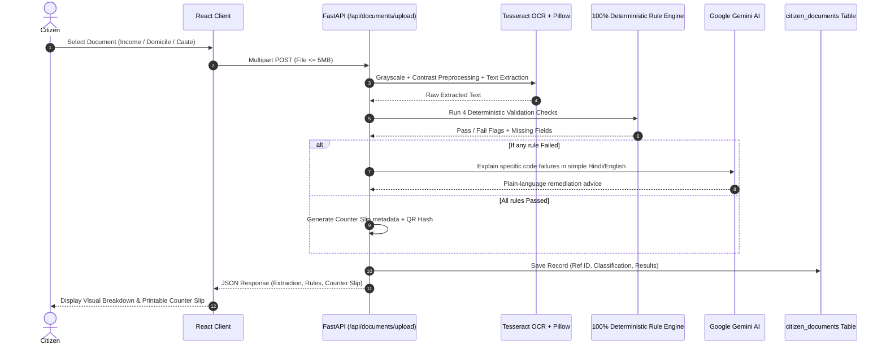

# GovSkill — Comprehensive Viva Examination & Interview Guide

> **Target Audience:** College External Examiners, Technical Interviewers, Project Viva Panels.  
> **Approach:** Simple, confident language with deep architectural reasoning. Every decision is grounded in real engineering principles.

---

## 📑 Table of Contents
1. [30-Second & 2-Minute Project Elevator Pitch](#1-30-second--2-minute-project-elevator-pitch)
2. [Why Did We Build GovSkill? (Problem Statement & Solution)](#2-why-did-we-build-govskill-problem-statement--solution)
3. [Full Technical Stack & Architectural Justifications](#3-full-technical-stack--architectural-justifications)
4. [GovAssist Document Intelligence (Deep Dive)](#4-govassist-document-intelligence-deep-dive)
5. [Civil Servant Competency & Dual-Mode AI Mentor](#5-civil-servant-competency--dual-mode-ai-mentor)
6. [Database Design, SQLAlchemy & Alembic Migrations](#6-database-design-sqlalchemy--alembic-migrations)
7. [API Layer, Endpoints & Data Flow](#7-api-layer-endpoints--data-flow)
8. [Security, Authentication & DPDP Compliance](#8-security-authentication--dpdp-compliance)
9. [Automated Testing & Production Deployment](#9-automated-testing--production-deployment)
10. [Top 20 Rapid-Fire Viva Questions & Answers](#10-top-20-rapid-fire-viva-questions--answers)

---

## 1. 30-Second & 2-Minute Project Elevator Pitch

### ⏱️ 30-Second Pitch (Quick Summary)
> *"GovSkill ek full-stack sovereign civic platform hai jo local government offices ke do sabse bade challenges solve karta hai:*
> 1. *Civic employees ki statutory training, continuous evaluation, aur HMAC-SHA256 digitally-signed certification.*
> 2. *Citizens ke liye zero-login self-service pre-check portal (GovAssist) jo certificates (Income, Domicile, Caste) ko counter par line lagane se pehle OCR aur 100% deterministic code rules se verify karta hai aur instant counter slip generate karta hai.*
> 
> *Tech stack me FastAPI, React 18 TypeScript, PostgreSQL 16 with async SQLAlchemy, Tesseract OCR, aur Google Gemini AI use hua hai. Yeh system production me Render par live deployed hai."*

---

### 🎙️ 2-Minute Pitch (Detailed Overview)
> *"Respected Ma'am/Sir, traditional municipal aur taluk offices me do major problems hoti hain:*
> 
> *Pehli problem: Citizens jab Income ya Domicile certificate submit karne aate hain, toh unhe ghanto line me khada hona padta hai, aur counter par pata chalta hai ki certificate expired hai ya seal missing hai, jisse unki application reject ho jaati hai.*  
> *Dusri problem: Municipal staff ke paas naye government circulars aur legal acts padhne ka structured mechanism nahi hota, aur na hi unki digital competency accurately measure ho paati hai.*
> 
> *Iska solution humne **GovSkill** ke roop me banaya hai:*
> - *Citizen side par **GovAssist** hai: Citizen bina kisi registration ke apna document upload karta hai. System local Tesseract OCR se text extract karta hai, aur Python ke 4 strict deterministic code-based rules se verify karta hai. Agar koi error ho, toh Google Gemini AI citizen ko aasan bhasha me samjhata hai ki kya galat hai aur kya step lena hai. Document pass hone par QR-coded printable Counter Slip milti hai.*
> - *Employee side par structured **Curriculum Modules** hain, ek **Dual-Mode AI Mentor** hai (jo grounded training mode me circulars ke bahar hallucinate nahi karta, aur general mode me multilingual assistance deta hai), aur ek **Tamper-Proof Server-Scored Examination** hai jisme pass hone par HMAC-SHA256 cryptographic verification certificate milta hai.*
> - *Architecture me **FastAPI** as asynchronous backend engine, **PostgreSQL 16** with async SQLAlchemy, **Alembic** migrations, aur **React 18 TypeScript** with Vite use kiya hai. Poora system Render cloud par live hai."*

---

## 2. Why Did We Build GovSkill? (Problem Statement & Solution)

| Existing Problem | GovSkill Solution | Architectural Decision |
|---|---|---|
| **High Counter Rejections:** 30–40% citizen applications counter par minor errors (expiry, missing seal) ki wajah se reject hoti hain. | **GovAssist Pre-Check:** Citizen counter par jaane se pehle ghar baithe ya CSC center par document pre-check kar sakta hai. | Client-side 5MB limit, Tesseract OCR preprocessing, zero citizen PII stored. |
| **Unreliable AI Hallucinations:** LLM ko agar validation diya jaye toh wo hallucinate karke invalid document ko pass kar sakta hai. | **100% Deterministic Rule Engine:** Validation pass/fail ka decision exclusively Python code aur Regex lete hain, AI nahi! | AI is strictly restricted to plain-language explanation of already failed rules. |
| **Out-of-Scope Employee Training:** Training bots internet ka random data quote karte hain jo local circulars se match nahi karta. | **Dual-Mode AI Mentor:** Grounded Mode strictly official departmental manuals me se hi answer deta hai. | Context injection with refusal guardrail if query is out of syllabus. |
| **Tamperable Certificates:** Inspect element karke HTML certificates edit kiye ja sakte hain. | **HMAC-SHA256 Digital Verification:** Public portal (`/verify`) signature digest verify karta hai. | Cryptographic hash checks Certificate ID + Officer Name + Score against secret key. |

---

## 3. Full Technical Stack & Architectural Justifications

### Examiner Question: *"Yeh specific tech stack kyu choose kiya? Alternates kyu nahi use kiye?"*

### 1. Backend: FastAPI (Python 3.11+)
- **Kyu choose kiya:**
  1. **Native Asynchronous Performance (`async`/`await`):** FastAPI Starlette aur Uvicorn par chalta hai, jo high-concurrency requests ko non-blocking I/O ke sath handle karta hai.
  2. **Pydantic v2 Type Safety:** Request payloads aur response serialization 100% validate hote hain at runtime (C-based `pydantic-core`).
  3. **Auto-Generated OpenAPI/Swagger Docs:** `/docs` par real-time interactive API playground milta hai.
  4. **Python AI/OCR Ecosystem:** PyTesseract aur Google GenAI SDK Python native hain. Node.js me OCR aur AI integration ke liye child processes spawn karne padte jo overhead create karta.
- **Alternates kyu reject kiye:**
  - *Django:* GovSkill REST API-first architecture hai; Django ka bulky monolithic ORM aur template engine unnecessary overhead create karta.
  - *Express/Node.js:* Python ka data handling aur OCR library support (Pillow, Tesseract) Node.js se kaafi superior aur stable hai.

### 2. Database: PostgreSQL 16 (Managed) + Async SQLAlchemy 2.0
- **Kyu choose kiya:**
  1. **Strict Relational Integrity:** Civic certifications aur quiz attempts relational data hain (ACID compliance mandatory hai).
  2. **Async Driver (`asyncpg`):** Database queries event loop ko block nahi karti.
  3. **Alembic Database Migrations:** Schema changes code-versioned hote hain, manual SQL execution ki zarurat nahi hoti.
  4. **SQLite Local Fallback:** Development environment me bina heavy PostgreSQL server setup kiye rapid testing ho sakti hai.
- **MongoDB kyu reject kiya:**
  - Financial, legal aur citizen records tabular aur interconnected hote hain. NoSQL me foreign key integrity aur strict schema validation maintain karna difficult hota hai.

### 3. Frontend: React 18 + Vite (TypeScript Strict)
- **Kyu choose kiya:**
  1. **Strict TypeScript:** Runtime `undefined` errors eliminate hote hain; API contracts backend Pydantic schemas ke mirror hote hain.
  2. **Vite Bundler:** Cold start sub-second me hota hai via native ES modules (Rollup for production build).
  3. **Component Reusability:** Modular architecture (Modals, Radar Chart, Lesson Folio, Document Scanner).
  4. **Tailwind CSS 3:** Clean, bespoke editorial design tokens; zero runtime CSS overhead.
- **Next.js kyu reject kiya:**
  - GovSkill ek Single Page Application (SPA) hai jo Render ke global CDN par deploy hoti hai. SSR (Server-Side Rendering) ki dependency se deployment aur maintenance complexity badh jaati.

---

## 4. GovAssist Document Intelligence (Deep Dive)



### The 4 Deterministic Code-Based Rules
1. **Rule 1 — Applicant Name Presence:** Extracted text me applicant name pattern detect hona chahiye (non-empty & meaningful).
2. **Rule 2 — Certificate Number Format:** Standard statutory regex match (e.g., `^[A-Z]{3}[0-9]{6,12}$`).
3. **Rule 3 — Non-Expired Validity Date:** Certificate issuance aur expiry dates parse karke current timestamp se compare ki jaati hain.
4. **Rule 4 — Issuing Authority / Seal Presence:** Tehsildar / Revenue Officer signature block text me present hona chahiye.

### ⚠️ Golden Viva Question: *"Validation ke liye LLM kyu use nahi kiya?"*
> **Answer:** *"Sir/Ma'am, LLMs non-deterministic hote hain aur probabilistic text generation par chalte hain. Ek hi document par AI subah 'Pass' bol sakta hai aur shaam ko 'Fail'. Government standard statutory compliance me hallucinations illegal aur unconstitutional hain. Isliye validation ka decision 100% deterministic code aur Regex lete hain. Gemini AI sirf tab call hota hai jab code kisi rule ko fail karta hai, taaki wo citizen ko simple language me samjha sake ki problem kya hai."*

---

## 5. Civil Servant Competency & Dual-Mode AI Mentor

### 1. Dual-Mode AI Mentor (`/tutor`)
- **Mode A: Grounded Training Mode:**
  - Departmental circulars aur approved lesson curriculum ke content ko context window me inject kiya jaata hai.
  - Agar officer curriculum ke bahar ka sawal puchta hai, prompt guardrail strictly instruct karta hai: *"This inquiry falls outside the municipal training curriculum. Please refer to administrative guidelines."*
- **Mode B: General AI Chat Mode:**
  - Broad public governance, administrative draft writing, technical inquiries, aur Hindi/English queries ko answer karta hai.
  - Dono modes ke session state aur chat history isolated rehte hain.

### 2. Tamper-Proof Server-Scored Quiz (`/quiz`)
- **Zero Client Trust:** Frontend ko questions bhejte waqt `correct_option_index` **kabhi nahi bheja jaata**.
- User ka response array (`selected_options: [2, 0, 1, 3]`) `/api/quiz/{module_id}/submit` par jaata hai.
- Evaluation exclusively server database me hota hai. Pass hone ke liye mandatory **75% benchmark** required hota hai.

### 3. Cryptographic Certificate Verification (`/verify`)
- Jab officer qualify hota hai (Score ≥ 75%), system ek cryptographic certificate generate karta hai:
$$\text{Signature} = \text{HMAC-SHA256}(\text{Key}, \text{cert\_id} + \text{user\_id} + \text{score} + \text{issued\_at})$$
- `/verify` portal par koi bhi citizen ya supervisor Certificate ID daal kar authenticate kar sakta hai. Agar database me score ya naam tamper kiya gaya ho, toh signature mismatch detect ho jaata hai.

---

## 6. Database Design, SQLAlchemy & Alembic Migrations

### Core Relational Schema

```
+--------------------+       +-----------------------+       +------------------------+
|      users         |       |        modules        |       |        lessons         |
+--------------------+       +-----------------------+       +------------------------+
| id (PK, UUID)      |<---+  | id (PK, UUID)         |<---+  | id (PK, UUID)          |
| email (Unique)     |    |  | code (Unique)         |    |  | module_id (FK->modules)|
| hashed_password    |    |  | title                 |    +--| title                  |
| role (admin/emp)   |    |  | passing_threshold=75  |       | order_index            |
| token_version      |    |  +-----------------------+       | content_markdown       |
+--------------------+    |                                  +------------------------+
          |               |
          |               |  +-----------------------+       +------------------------+
          |               |  |     quiz_questions    |       |     quiz_attempts      |
          |               |  +-----------------------+       +------------------------+
          |               +--| module_id (FK->modules)|       | id (PK, UUID)          |
          |                  | question_text         |       | user_id (FK->users)----+
          |                  | options (JSON)        |       | module_id (FK->modules)|
          |                  | correct_option_index  |       | score (Integer)        |
          |                  +-----------------------+       | passed (Boolean)       |
          |                                                  | certificate_id         |
          |                                                  | hmac_signature         |
          |                                                  +------------------------+
          |
          X  <-- [ZERO FOREIGN KEY - DPDP PRIVACY ISOLATION]
          |
+------------------------------------+
|         citizen_documents          |
+------------------------------------+
| id (PK, UUID)                      |
| reference_id (Unique Lookup UUID)  |
| document_type (income/caste/etc.)  |
| extracted_data (JSON)              |
| validation_results (JSON)          |
| status (passed/failed)             |
| created_at (Timestamp)             |
+------------------------------------+
```

### Key Architectural Highlights:
1. **PII Privacy Isolation:** `citizen_documents` table ka `users` table se koi Foreign Key nahi hai. Citizen uploads completely anonymous hain.
2. **Alembic Linear Migrations:** 6 migration revisions hain:
   - `001_initial_schema` — Users, Modules, Lessons, Quiz.
   - `002_add_citizen_documents` — Citizen document pre-check storage.
   - `003_add_confidence_scores` — OCR extraction confidence.
   - `004_add_certificate_signatures` — HMAC-SHA256 signature fields.
   - `005_add_multi_doc_types` — Domicile, Caste, and Identity schemas.
   - `006_token_version_active` — Token invalidation & active status.

---

## 7. API Layer, Endpoints & Data Flow

| Endpoint | HTTP Method | Access Level | Description |
|---|---|---|---|
| `/health` | `GET` | Public | Real-time database connection & service health probe. |
| `/api/auth/login` | `POST` | Public | Authenticates credentials, returns signed JWT access token. |
| `/api/auth/me` | `GET` | Bearer Token | Returns current authenticated user profile & role. |
| `/api/modules` | `GET` | Public | Returns published training modules with lesson catalogs. |
| `/api/modules/{id}` | `GET` | Public | Returns detailed lesson reader content for a module. |
| `/api/tutor/chat` | `POST` | Bearer Token | Dual-Mode AI Mentor (Grounded Training vs General AI). |
| `/api/quiz/{id}/questions`| `GET` | Bearer Token | Returns questions **without** answer keys. |
| `/api/quiz/{id}/submit` | `POST` | Bearer Token | Evaluates quiz server-side, saves attempt, signs certificate. |
| `/api/documents/upload` | `POST` | Public | OCR extraction, 4-rule validation, AI remediation advice. |
| `/api/documents/{ref_id}`| `GET` | Public | Look up past pre-check result and reprint Counter Slip. |
| `/api/verify/{cert_id}` | `GET` | Public | Validates digital credential authenticity via HMAC digest. |
| `/api/admin/metrics` | `GET` | Admin Role | Departmental participation, pass rates, competency gaps. |
| `/api/admin/export` | `GET` | Admin Role | Exports compliance logs to CSV or JSON format. |

---

## 8. Security, Authentication & DPDP Compliance

1. **Password Security:** Passwords plain text me store nahi hote. `passlib` with `bcrypt` (work factor 12) use hota hai with cryptographic salt.
2. **JWT Session Lifecycle:**
   - Stateless HS256 JWT tokens with standard 60-minute expiry.
   - **Immediate Session Invalidation:** Users table me `token_version` column hai. Jab user password change karta hai ya admin revoke karta hai, `token_version` increment ho jata hai aur purane saare JWT tokens invalid ho jaate hain.
3. **CORS (Cross-Origin Resource Sharing):** Production me wildcard `*` strictly disallowed hai. Sirf Render frontend URL aur local dev origins allowed hain.
4. **Digital Personal Data Protection (DPDP) Act 2023:**
   - Citizen pre-check me zero citizen signup required.
   - Citizens ka koi personal account create nahi hota.
   - Reference IDs cryptographically random UUIDv4 hain.

---

## 9. Automated Testing & Production Deployment

### Automated Test Suite
- **Backend (Pytest):** **118 automated tests** passing (Auth, Rate Limiting, OCR Mocking, Rule Engine, Quiz Scoring, Security).
- **Frontend (Vitest + Testing Library):** **114 automated tests** passing across 23 test suites.
- **Linter:** `ruff` clean execution on all backend services.

### Production Cloud Architecture (Render)
- **Frontend:** Static Single Page Application (SPA) deployed on Render Global CDN with client-side rewrite rules (`/* -> /index.html`).
- **Backend:** Containerized Docker runtime running Python 3.11-slim with system Tesseract OCR binaries and unprivileged non-root user (`appuser`).
- **Database:** Render Managed PostgreSQL 16 cluster with automated connection pooling and daily backup snapshots.

---

## 10. Top 20 Rapid-Fire Viva Questions & Answers

#### Q1: "GovAssist aur normal OCR tool me kya difference hai?"
> **Ans:** Normal OCR tool sirf raw text nikalta hai. GovAssist extracted text par 4 deterministic statutory business rules run karta hai, expiry aur formats check karta hai, failed checks par AI explanation deta hai, aur physical submission ke liye QR-coded counter slip generate karta hai.

#### Q2: "Aapke project me AI ka role exact kahan hai?"
> **Ans:** AI strictly do jagah use hua hai:
> 1. Dual-Mode AI Mentor (`/tutor`) me civil servant queries answer karne ke liye.
> 2. Citizen portal par fail hue rules ki plain-language me explanation dene ke liye. AI validation pass/fail decide nahi karta.

#### Q3: "Quiz answer key client side kyu nahi bheji jaati?"
> **Ans:** Security integrity ke liye. Agar correct option client side bhej diya jaye, toh browser DevTools inspect karke answer leak ho sakta hai. Isliye evaluation 100% server-side hota hai.

#### Q4: "HMAC-SHA256 certification verification kaise kaam karta hai?"
> **Ans:** Jab employee pass hota hai, system secret key aur student details (ID, name, score, timestamp) ko mila kar ek cryptographic hash digest banata hai. `/verify` endpoint par wahi data recalculate karke match kiya jaata hai. Agar score 1% bhi alter kiya gaya ho, toh signature mismatch ho jata hai.

#### Q5: "Citizen documents table ka users table se foreign key relation kyu nahi hai?"
> **Ans:** DPDP Act 2023 aur PII (Personally Identifiable Information) data isolation ke liye. Citizen verification anonymous self-service hai. Hum citizen documents ko internal employee accounts se link nahi karte.

#### Q6: "Alembic migrations kyu zaruri hain? Direct table kyu nahi banayi?"
> **Ans:** Direct SQL queries se schema evolution ka record nahi rehta. Alembic se schema changes version control me track hote hain aur production server start hote hi automatic `alembic upgrade head` se database sync ho jaata hai.

#### Q7: "Pydantic v2 ka kya fayda hua?"
> **Ans:** Pydantic v2 Rust-based `pydantic-core` par chalta hai jo JSON serialization aur data validation ko 5x-10x fast banata hai aur strict type enforcement provide karta hai.

#### Q8: "FastAPI me sync aur async functions kab use karte hain?"
> **Ans:** Database queries (`asyncpg`), external network calls, aur file I/O me `async def` use karte hain taaki event loop block na ho. CPU-bound tasks jaise image filtering ya heavy cryptographic calculations me threadpool ya synchronous logic use hoti hai.

#### Q9: "JWT token expire hone par kya hota hai?"
> **Ans:** Frontend Axios response interceptor 401 Unauthorized status code catch karta hai, local storage se stale token clear karta hai, aur user ko clean login page par redirect kar deta hai.

#### Q10: "Bcrypt kyu use kiya? MD5 ya SHA256 kyu nahi?"
> **Ans:** MD5 aur standard SHA256 fast hashing algorithms hain jo rainbow tables aur GPU brute-force attacks ke samne vulnerable hote hain. Bcrypt ek intentionally slow, salted, key-stretching algorithm hai jo brute force attacks ko prevent karta hai.

#### Q11: "Aapne Vite kyu choose kiya Webpack ki jagah?"
> **Ans:** Webpack poora bundle memory me compile karta hai, jabki Vite native ES modules (ESM) use karta hai. Isse development server instantaneous reload hota hai aur production bundle Rollup se highly optimized nikalta hai.

#### Q12: "CORS kya hota hai aur aapne ise kaise configure kiya?"
> **Ans:** Cross-Origin Resource Sharing ek browser security policy hai jo different domain/port se API requests restrict karti hai. Humne FastAPI me `CORSMiddleware` lagaya hai jo sirf authorized origins (Render frontend URL aur local dev port) ko allow karta hai.

#### Q13: "Citizen document upload me file size limit kaise enforce ki?"
> **Ans:** Do level par enforce ki hai:
> 1. Frontend: File select hote hi JavaScript check karta hai (`file.size > 5 * 1024 * 1024`).
> 2. Backend: Stream read karte waqt byte count 5MB exceed hote hi HTTP 413 Payload Too Large return hota hai.

#### Q14: "Tesseract OCR degraded scans ko kaise handle karta hai?"
> **Ans:** Direct OCR chalane se pehle Pillow library se image pre-processing hoti hai: contrast boost, grayscale conversion, aur adaptive thresholding taaki noisy background clean ho sake.

#### Q15: "Admin dashboard me kya capabilities hain?"
> **Ans:** Supervisor portal me departmental readiness metrics, employee passing rates, domain competency breakdown (radar metrics), quiz attempts audit log, aur CSV/JSON reports export karne ki suvidha hai.

#### Q16: "Render par backend aur frontend kaise communicate kar rahe hain?"
> **Ans:** Frontend static CDN par host hai aur environment variable `VITE_API_BASE_URL` se backend REST API (`https://govskill-backend.onrender.com/api`) ko HTTPS over TLS 1.3 se call karta hai.

#### Q17: "Database me connection pooling kya hoti hai?"
> **Ans:** Har request par naya DB connection kholne aur band karne me high latency hoti hai. SQLAlchemy async connection pool active connections ko maintain rakhta hai aur requests me reuse karta hai.

#### Q18: "Token Versioning (Revocation) kya hoti hai?"
> **Ans:** Stateless JWT ka sabse bada disadvantage hota hai ki wo expire hone se pehle revoke nahi ho sakta. Humne `users` table me `token_version` column add kiya hai jo JWT payload me embed hota hai. Logout ya password reset par token version increment ho jaata hai, jisse purane tokens instantly reject ho jaate hain.

#### Q19: "Accessibility (WCAG) ke liye kya kiya gaya hai?"
> **Ans:** WCAG 2.2 AA standards follow kiye gaye hain: semantic HTML5 elements, keyboard tab navigation, visible focus rings, aria labels, aur high-contrast color palette for extended reading.

#### Q20: "Project ka future scope kya hai?"
> **Ans:** Regional languages (Malayalam, Marathi, Kannada) me Tesseract OCR training, Digilocker API integration for instant digital verification, aur mobile application development.
